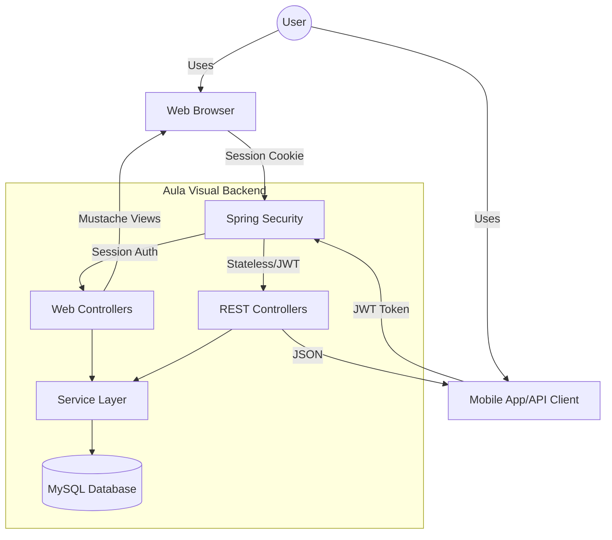
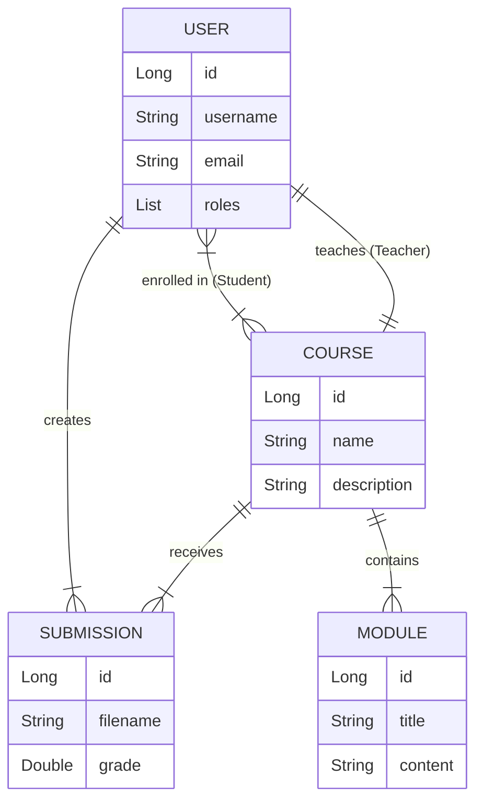
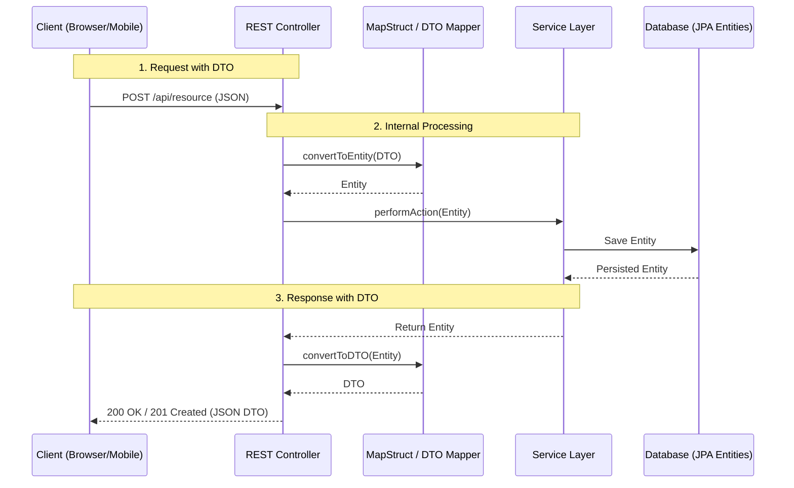
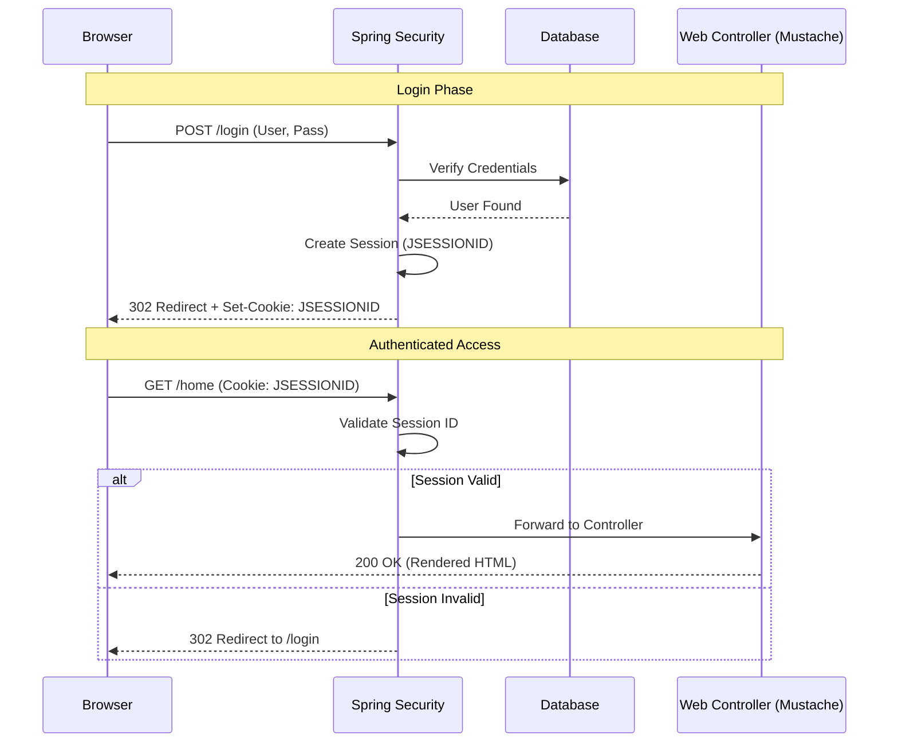
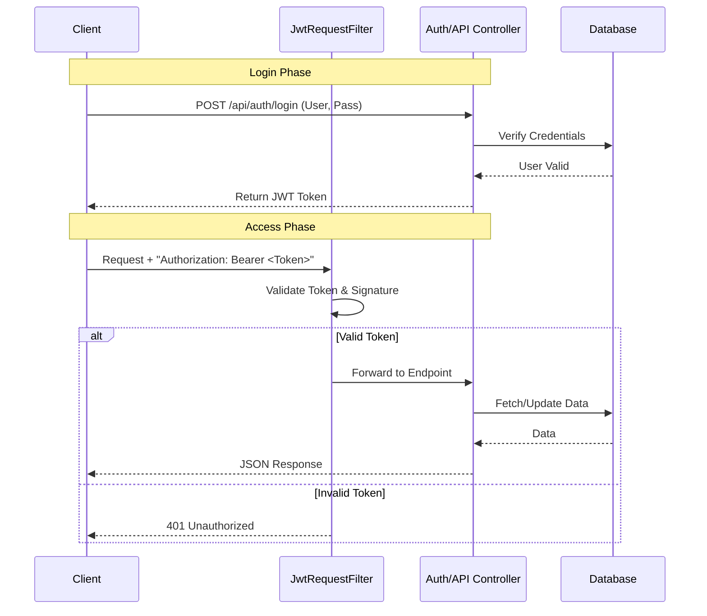

## 1. Project Overview

**Aula Visual** is a simulated web application for academic purposes. It simulates a moodle enviroment for a university course, where students can submit assignments and teachers can grade them.

## 2. Technology Stack

### Core Technologies
- **Language**: Java 23
- **Framework**: Spring Boot 3.4.4
- **Build Tool**: Maven

### Web & API
- **Web Template Engine**: Mustache
- **API Documentation**: SpringDoc OpenAPI (Swagger UI)
- **DTO Mapping**: MapStruct 1.6.3

### Database & Persistence
- **Database**: MySQL 8.4.0
- **ORM**: Spring Data JPA / Hibernate

### Security
- **Framework**: Spring Security
- **Authentication**: 
  - Session-based for Web UI
  - JWT (JSON Web Token) for REST API
- **Sanitization**: OWASP Java HTML Sanitizer
- **And more...**

## 3. Project Structure

The project follows a standard layered architecture. Below is the high-level system interactions:

## 4. Database Schema & Entities

### Main Entities
1.  **User**: Represents system users.
    *   **Roles**:
        *   `0`: **Administrator** (Manage users, courses, assignments)
        *   `1`: **Teacher** (Manage own courses, evaluate submissions)
        *   `2`: **Student** (View courses, upload submissions)
    *   **Relationships**: 
        *   Many-to-Many with `Course` (as students)
        *   One-to-One with `Course` (as teacher)
        *   One-to-Many with `Submission`
2.  **Course**: Educational courses.
    *   **Relationships**: Has one Teacher, many Students, many Modules.
3.  **Module**: Content units within a course.
    *   **Relationships**: Belongs to a Course.
4.  **Submission**: Student assignments.
    *   **Relationships**: Belongs to a User and a Course.

### Key Relationships
*   **User - Course**: Users can be students in multiple courses. A Course has one dedicated Teacher.
*   **Course - Module**: A Course contains multiple Modules.
*   **User - Submission**: A User submits work (Submission) for a Course.

### Data Transfer Objects (DTOs)

**Data Transfer Objects (DTOs)** are simple objects used to transport data between application layers, specifically between the REST controllers and the service layer.

In this project, they are utilized for:
*   **Decoupling**: They separate the internal database schema (JPA Entities) from the external API contract, allowing the database to evolve without breaking client integrations.
*   **Security**: They prevent the accidental exposure of sensitive entity fields (e.g., password hashes or internal metadata) by only including necessary properties in the API response.
*   **Performance**: They avoid "Circular Reference" issues common in JPA many-to-many relationships by flattening complex object graphs into simple, serializable structures.
*   **Validation**: They serve as the primary target for request validation annotations, ensuring that only clean, well-formatted data enters the business logic layer.

## 5. Security Architecture (Deep Dive)

The application implements a **Dual-Chain Security Model**, decoupling the Web UI from the REST API. This allows optimizing security protocols for specific use cases.

### 5.1. Authentication Architecture

#### A. Web UI (Browser-Based)
*   **Mechanism**: Stateful Session Management (`JSESSIONID`).
*   **Why?** Browsers handle cookies automatically and securely (HttpOnly, Secure). It provides a seamless experience for server-side rendered pages.
*   **Flow**: Users log in via a Form (`/login`). The server creates a session and stores the ID in a signed cookie.

#### B. REST API (Headless Clients/Mobile)
*   **Mechanism**: Stateless JWT (JSON Web Tokens).
*   **Why?** APIs should be stateless to scale horizontally. Cookies are often problematic for non-browser clients (mobile apps, 3rd party integrations).
*   **How it works**:
    1.  Client sends credentials to `/api/auth/login`.
    2.  Server verifies and returns a signed **JWT**.
    3.  Client sends this token in the `Authorization: Bearer <token>` header for subsequent requests.
    4.  A custom `JwtRequestFilter` intercepts requests, validates the signature, and authenticates the user context *before* the request reaches the controller.

## 6. Security Focus

1. XSS
2. CSRF (not seen in this presentation)
3. SQL Injection (not seen in this presentation)
4. IDOR (not seen in this presentation)
5. Broken Authentication (not seen in this presentation)

### Brief explanation of each vulnerability

#### 1. XSS (Cross-Site Scripting)
**What it is:** An attack where malicious scripts are injected into trusted websites. When another user visits the site, their browser executes the script, potentially stealing cookies, session tokens, or sensitive information.
**How we prevent it:** We use Thymeleaf's automatic escaping. Any user-provided content rendered in HTML is automatically converted to its safe representation (e.g., `<script>` becomes `&lt;script&gt;`), preventing the browser from executing it as code. We also use the OWASP sanitizer to sanitize before storing in the database.

# Video demo of XSS (error in class presentation)
[Video here](https://haagahelia-my.sharepoint.com/:v:/g/personal/bib709_myy_haaga-helia_fi/IQAVVJvanw92QK-EI5Xeu2rXAb8JdBJg13ULXKGspdZ7tpw?nav=eyJyZWZlcnJhbEluZm8iOnsicmVmZXJyYWxBcHAiOiJPbmVEcml2ZUZvckJ1c2luZXNzIiwicmVmZXJyYWxBcHBQbGF0Zm9ybSI6IldlYiIsInJlZmVycmFsTW9kZSI6InZpZXciLCJyZWZlcnJhbFZpZXciOiJNeUZpbGVzTGlua0NvcHkifX0&e=c3PsRR)